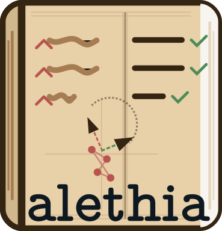

=======
alethia
=======

A Python package for entity matching, standardization, and visualization using embeddings from large language models.

Alethia helps you clean and standardize messy entity data (like location names, product names, medical records, ...) by
leveraging semantic similarity and embedding visualizations.

Installation
===========

You can install alethia via pip:

.. code-block:: bash

    pip install alethia

For development installation:

.. code-block:: bash

    mamba create -n alethia python pip
    mamba activate alethia
    git clone https://github.com/saketlab/alethia.git
    cd alethia
    pip install -e .

Quick Start
==========

Basic Entity Matching
--------------------

.. code-block:: python

    import pandas as pd
    from alethia import alethia

    # Load your data
    df = pd.read_csv("your_data.csv")

    # Define reference entries (correct, standardized entities)
    reference_entries = [x for x in list(set(df["correct_column"])) if str(x) != "nan"]

    # Match incorrect entries against reference entries
    incorrect_entries = df["incorrect_column"].tolist()
    alethia_output = alethia(incorrect_entries, reference_entries)

    # View entries that were corrected
    corrected = alethia_output[alethia_output.given_entity != alethia_output.alethia_prediction]
    print(corrected)

Visualizing Entity Embeddings
----------------------------

.. code-block:: python

    import matplotlib.pyplot as plt
    import seaborn as sns
    from alethia import (
        do_pca,
        do_umap,
        get_embeddings,
        load_sentence_transformer,
        plot_embedding
    )

    # Load a sentence transformer model
    model = load_sentence_transformer("Salesforce/SFR-Embedding-Mistral")

    # Create embeddings for your entities
    entities = ["Entity 1", "Entity 2", "Entity 3", ...]
    embeddings = get_embeddings(texts=entities, model=model, show_progress=True)

    # Dimensionality reduction with PCA
    pca, exp_var = do_pca(embeddings, return_expl_var=True)

    # Dimensionality reduction with UMAP
    umap = do_umap(embeddings)

    # Plot the results
    plot_embedding(
        pca,
        labels=entities,
        dims=[1, 2],
        title="PCA of Entity Embeddings",
        explained_var=exp_var
    )

    plot_embedding(
        umap,
        labels=entities,
        dims=[1, 2],
        title="UMAP of Entity Embeddings"
    )

Features
========

Entity Matching and Standardization
----------------------------------

* Align messy entity names with a reference list of standardized entries
* Based on semantic similarity using transformer embeddings
* Handles typos, abbreviations, and other common data entry inconsistencies

Embedding Analysis
----------------

* Generate embeddings for text entities using state-of-the-art models
* Reduce dimensionality with PCA or UMAP for visualization and analysis
* Identify clusters and outliers in your entity data

Visualization
-------------

* Plot embeddings with customizable visualizations
* Compare different embedding projections

Use Cases
========

* Standardizing location names across disparate datasets
* Aligning entity records from multiple sources
* Exploring semantic relationships between entities

License
=======

MIT

Contributing
===========

Contributions are welcome! Please feel free to submit a pull request.
